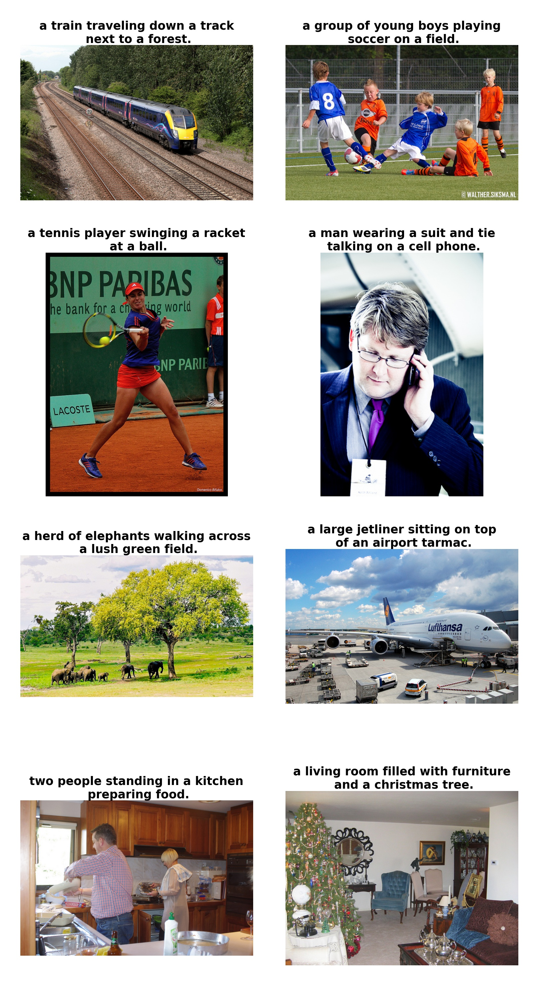

### Noah Weiner, Kaleb Gezahegn, Evan Strittmatter ###  

## Changelog - Noah Weiner ##  
* 12/11/22  
    1. Change some import statements (i.e. in eval.py, cider.py, bleu.py) and print statements to match Python 3.10 syntax  
    2. Create requirements.txt to specify what pip packages are required  
    3. In Tf2, there's no longer the tensorflow.contrib.layers package, so change anything that uses that pkg in nn.py to use the corresponding Tensorflow 2 keras element  
    4. In Python 3.10, you can no longer use tuples as function parameters. Change definition of cook_test() in blue_scorer.py to just unpack the tuples at beginning of function instead  
    5. For Tensorflow 2, change to use tf.compat.v1.flags instead of tf.app.flags, and tf.compat.v1 in general instead of tf (in many files, including model.py)  
    6. Replace tf.contrib.layers with Tf Slim  
    7. Follow instructions here, in general: https://www.tensorflow.org/guide/migrate  
    8. Some other quirks of Python3 vs. older versions of python, like using items() instead of iteritems() on a dict  
* 12/14/22  
    9. Change the all_captions(), createIndex(), and init() functions in coco.py to optionally pull the COCO image url instead of creating the local filename for each image.  
    10. Add comments (walk through/understand code), improve variable names, and reduce lines of code in coco.py, dataset.py, main.py, and vocabulary.py.  
    11. Change prepare_train_data() in dataset.py to look at images in train/images local folder, extract the image IDs for the images from their filenames, and create the pandas dataframe by pulling only those images and
    their captions from the annotations section of the COCO JSON annotations file.  
    12. Add a clean.sh script to remove large temporary files that are created at runtime (i.e. vocabulary csv file, model checkpoints, the csv file containing the dataframe of all img IDs and their captions).  
    13. Change image loading code in misc.py to load images using skimage io function if imgs are URLs, otherwise to use cv2 imread() with local filename.
    14. Add a variable called "local" to config to specify to many files/functions whether images are being loaded from local folder or from URL.
* 12/18/22  
    15. Finish implementing the local and num_train_data options in config. If you set local True, Tf will read images from local folder, extract the img IDs from the filenames, and pull the appropriate captions from the annotations JSON. If set local False, you can specify the number of training images you want to use, and then Tf will pull that number of images from the COCO API during training.  
* 12/19/22
    16. During eval() in base_model.py, the val set from COCO is run through the network, and captions are generated. The function stores a list of dicts containing image id and the generated caption. Needed to cast these int64 image ids to regular Python int() in order to then be able to save the list of dicts into JSON file val/results.json.
    17. Resolve byte->string conversion errors using the tokenizer in ptbtokenizer.py, for evaluate() in eval.py.
    18. Use range() instead of deprecated xrange() for bleu_scorer.py.


  
  
### Introduction
This neural system for image captioning is roughly based on the paper "Show, Attend and Tell: Neural Image Caption Generation with Visual Attention" by Xu et al. (ICML2015). The input is an image, and the output is a sentence describing the content of the image. It uses a convolutional neural network to extract visual features from the image, and uses a LSTM recurrent neural network to decode these features into a sentence. A soft attention mechanism is incorporated to improve the quality of the caption. This project is implemented using the Tensorflow library, and allows end-to-end training of both CNN and RNN parts.

### Prerequisites
* **Tensorflow** ([instructions](https://www.tensorflow.org/install/))
* **NumPy** ([instructions](https://scipy.org/install.html))
* **OpenCV** ([instructions](https://pypi.python.org/pypi/opencv-python))
* **Natural Language Toolkit (NLTK)** ([instructions](http://www.nltk.org/install.html))
* **Pandas** ([instructions](https://scipy.org/install.html))
* **Matplotlib** ([instructions](https://scipy.org/install.html))
* **tqdm** ([instructions](https://pypi.python.org/pypi/tqdm))

### Usage
* **Preparation:** Download the COCO train2014 and val2014 data [here](http://cocodataset.org/#download). Put the COCO train2014 images in the folder `train/images`, and put the file `captions_train2014.json` in the folder `train`. Similarly, put the COCO val2014 images in the folder `val/images`, and put the file `captions_val2014.json` in the folder `val`. Furthermore, download the pretrained VGG16 net [here](https://app.box.com/s/idt5khauxsamcg3y69jz13w6sc6122ph) or ResNet50 net [here](https://app.box.com/s/17vthb1zl0zeh340m4gaw0luuf2vscne) if you want to use it to initialize the CNN part.

* **Training:**
To train a model using the COCO train2014 data, first setup various parameters in the file `config.py` and then run a command like this:
```shell
python main.py --phase=train \
    --load_cnn \
    --cnn_model_file='./vgg16_no_fc.npy'\
    [--train_cnn]    
```
Turn on `--train_cnn` if you want to jointly train the CNN and RNN parts. Otherwise, only the RNN part is trained. The checkpoints will be saved in the folder `models`. If you want to resume the training from a checkpoint, run a command like this:
```shell
python main.py --phase=train \
    --load \
    --model_file='./models/xxxxxx.npy'\
    [--train_cnn]
```
To monitor the progress of training, run the following command:
```shell
tensorboard --logdir='./summary/'
```

* **Evaluation:**
To evaluate a trained model using the COCO val2014 data, run a command like this:
```shell
python main.py --phase=eval \
    --model_file='./models/xxxxxx.npy' \
    --beam_size=3
```
The result will be shown in stdout. Furthermore, the generated captions will be saved in the file `val/results.json`.

* **Inference:**
You can use the trained model to generate captions for any JPEG images! Put such images in the folder `test/images`, and run a command like this:
```shell
python main.py --phase=test \
    --model_file='./models/xxxxxx.npy' \
    --beam_size=3
```
The generated captions will be saved in the folder `test/results`.

### Results
A pretrained model with default configuration can be downloaded [here](https://app.box.com/s/xuigzzaqfbpnf76t295h109ey9po5t8p). This model was trained solely on the COCO train2014 data. It achieves the following BLEU scores on the COCO val2014 data (with `beam size=3`):
* **BLEU-1 = 70.3%**
* **BLEU-2 = 53.6%**
* **BLEU-3 = 39.8%**
* **BLEU-4 = 29.5%**

Here are some captions generated by this model:


### References
* [Show, Attend and Tell: Neural Image Caption Generation with Visual Attention](https://arxiv.org/abs/1502.03044). Kelvin Xu, Jimmy Ba, Ryan Kiros, Kyunghyun Cho, Aaron Courville, Ruslan Salakhutdinov, Richard Zemel, Yoshua Bengio. ICML 2015.
* [The original implementation in Theano](https://github.com/kelvinxu/arctic-captions)
* [An earlier implementation in Tensorflow](https://github.com/jazzsaxmafia/show_attend_and_tell.tensorflow)
* [Microsoft COCO dataset](http://mscoco.org/)
